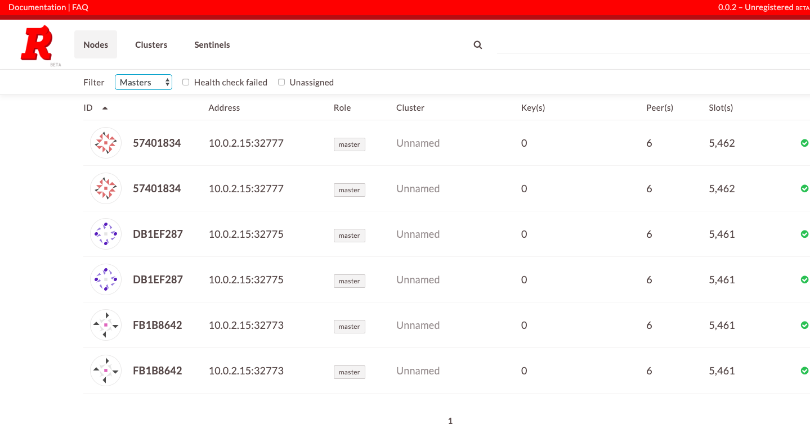

# ipresence-tasks
The demo implements, redis-cluster, rabbitmq-cluster, mysql-cluster using ansible, vagrant, and dockers

## Installation (MacOS)
1. VirtualBox: `brew cask install virtualbox`
2. Vagrant: `brew cask install vagrant`
3. Vagrant Plugins: `vagrant plugin install vagrant-auto_network && vagrant plugin install vai`
4. Ansible: `brew install ansible`

## Setup VM

```
vagrant up
```

## Task 1: redis-cluster
The demo sets up 6 redis instances - 3 master and 3 slaves

### Getting Started

#### Provision Redis Cluster
```
cd ansible
ansible-playbook provision_redis_cluster.yaml
```

#### Verify Redis Cluster

```
vagrant ssh
sudo docker ps
redis-cli -p 32779 # take port from one of the redis instance
cluster info
```

The output will look like following
```
127.0.0.1:32779> cluster info
cluster_state:ok
cluster_slots_assigned:16384
cluster_slots_ok:16384
cluster_slots_pfail:0
cluster_slots_fail:0
cluster_known_nodes:6
cluster_size:3
cluster_current_epoch:6
cluster_my_epoch:1
cluster_stats_messages_ping_sent:1764
cluster_stats_messages_pong_sent:1798
cluster_stats_messages_sent:3562
cluster_stats_messages_ping_received:1793
```

You can also view the cluster setup by accessing `https://localhost/` in the browser. The result should look like following:



#### Debugging

1. In case `cluster_state` is `fail` try re-running `ansible-playbook provision_redis_cluster.yaml`
2. In case `cluster_state` is still `fail` try re-running `sudo docker-compose up -d --build --scale redis=6` from within the vagrant box.
3. The issue happens because of the final command to setup the cluster may fail is some cases. Retrying generally works. But if it does not work as well try running following shell script:
```
cluster_hosts=''
docker ps -q -f label=redis | xargs docker inspect -f '{{range .NetworkSettings.Networks}}{{.IPAddress}}{{end}}' | 
{ 
  while read private_ip; do cluster_hosts=\"$$cluster_hosts $$private_ip:6379\"; done
  echo $$cluster_hosts
  docker run --net redis-cluster_default --rm redis:latest redis-cli -h redis --cluster create $$cluster_hosts --cluster-replicas 1 --cluster-yes
}
```

## Task 2: rabbitmq-cluster
This demo creates a 3 Node rabbitmq cluster behind HAProxy loadbalancer.

### Getting Started

#### Provision RabbitMQ Cluster

```
cd ansible
ansible-playbook provision_rabbitmq_cluster.yaml
```

#### Verify RabbitMQ Cluster

1. You can access HAProxy status report by accessing `http://localhost:1936/haproxy?stats` with the credentials `haproxy:haproxy`
2. You can access rabbitmq console via `http://localhost:15672/` with the credentials `admin:Admin@123`

#### Debugging

## Task 3: mysql-replication

### Getting Started

#### Provision MySQL replicaset

```
cd ansible
ansible-playbook provision_mysql_cluster.yaml
```

#### Verify MySQL Replicaset

#### Debugging